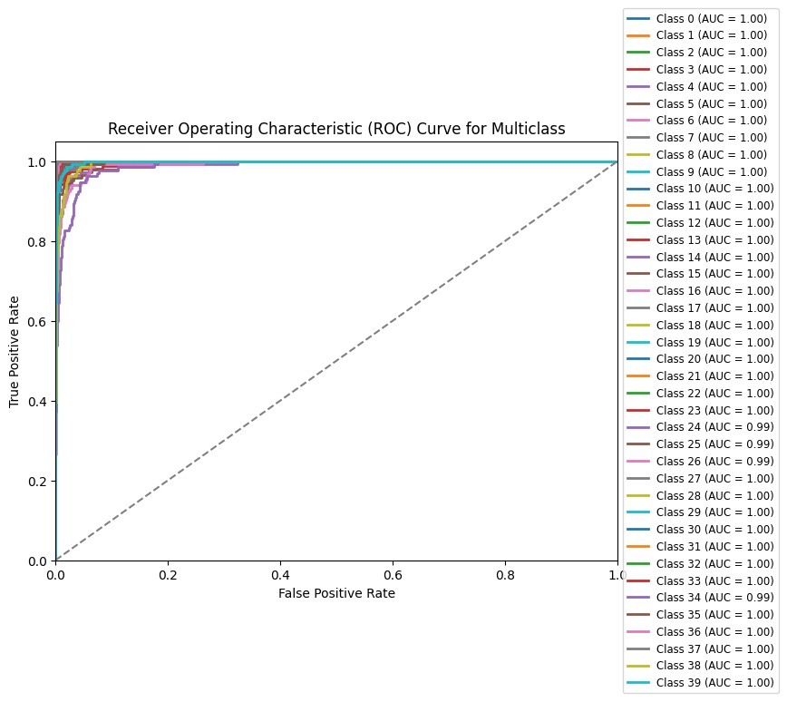
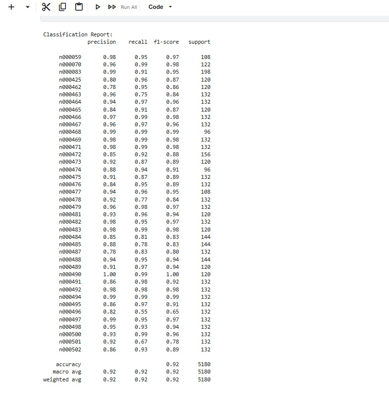
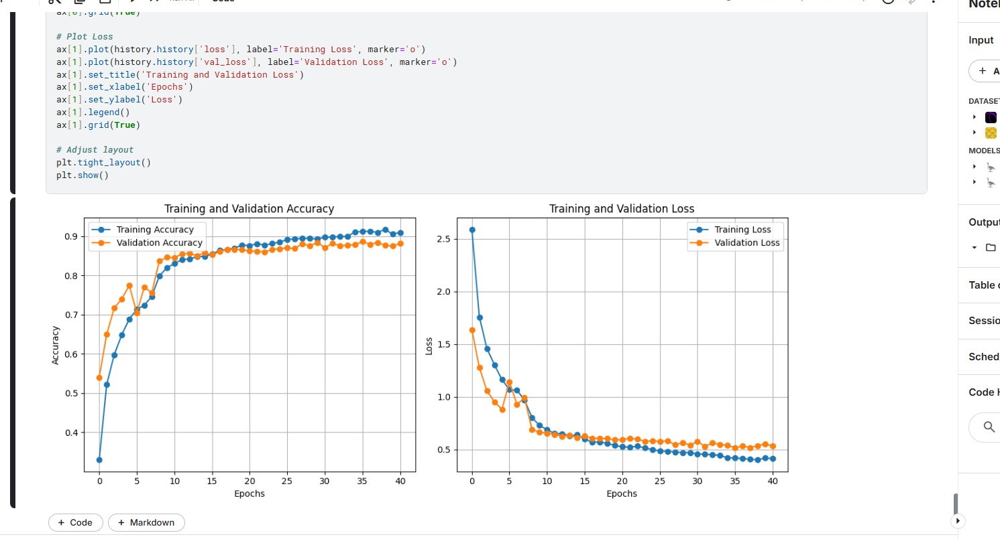

# Face Classification Project with DenseNet

## Overview
This project implements a face classification system using the DenseNet architecture. The model is trained to classify faces into multiple categories with high accuracy, as demonstrated by various evaluation metrics such as ROC curves, accuracy/loss plots, and a detailed classification report.

---

## Project Details

### 1. Model Architecture
- **Model Used**: DenseNet
- **Framework**: TensorFlow/Keras (or PyTorch, based on your code setup)
- **Purpose**: To classify facial images into multiple predefined classes.

### 2. Dataset
- **Dataset Description**: A labeled dataset of facial images.
- **Preprocessing**: Normalization, resizing, and augmentation applied to the dataset to improve model generalization.

---

## Results

### 1. Receiver Operating Characteristic (ROC) Curve
- The ROC curve shows an AUC (Area Under the Curve) close to 1 for all classes, indicating excellent classification performance.



### 2. Training and Validation Metrics
- **Training Accuracy and Validation Accuracy**: Both metrics show a consistent improvement over the epochs, stabilizing around 92%.
- **Training Loss and Validation Loss**: Loss values converge smoothly, indicating the absence of overfitting.



### 3. Classification Report
- **Precision, Recall, F1-Score**: High values across all classes.
- **Macro Average and Weighted Average**: Achieved 92% accuracy, recall, and F1-score.



---

## How to Run

### 1. Prerequisites
- Install required Python libraries:
  ```bash
  pip install tensorflow matplotlib numpy
  ```

### 2. Training the Model
- Run the training script to train the DenseNet model on your dataset.
  ```bash
  python train.py
  ```

### 3. Evaluating the Model
- After training, evaluate the model using the test set:
  ```bash
  python evaluate.py
  ```

### 4. Visualizing Results
- The code includes functionality to plot:
  - ROC Curves
  - Training and Validation Accuracy and Loss
  - Generate a Classification Report


---

## Conclusion
This project demonstrates the effectiveness of DenseNet for face classification tasks. The high AUC scores and consistent accuracy metrics highlight the model's robustness and suitability for similar classification problems.
